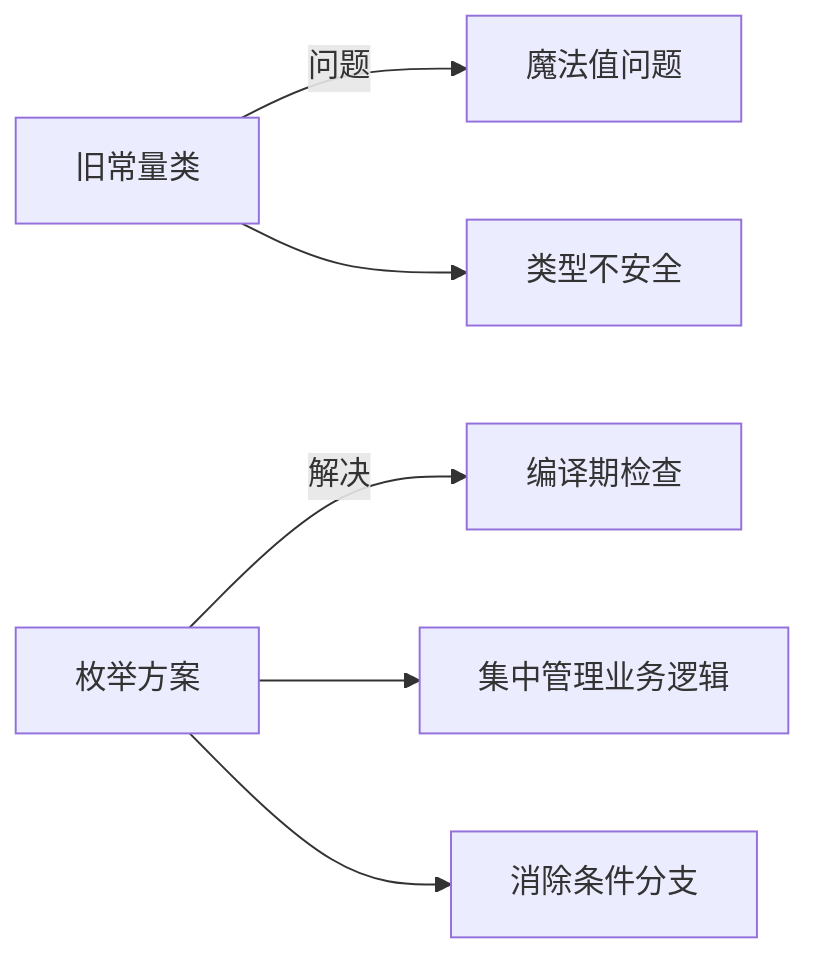

# cloudplus-tool
## 模块划分

```text
cloudplus-tool/
├── pom.xml
├── README.md
├── cloudplus-tool-core/          # 核心模块
│   ├── pom.xml
│   └── src/
├── cloudplus-tool-data/          # 数据源模块
│   ├── pom.xml
│   └── src/
├── cloudplus-tool-security/      # 安全模块
│   ├── pom.xml
│   └── src/
├── cloudplus-tool-web/           # Web模块
│   ├── pom.xml
│   └── src/
├── cloudplus-tool-common/        # 公共模块
│   ├── pom.xml
│   └── src/
└── cloudplus-tool-starter/       # 启动器模块
    ├── pom.xml
    └── src/
```

